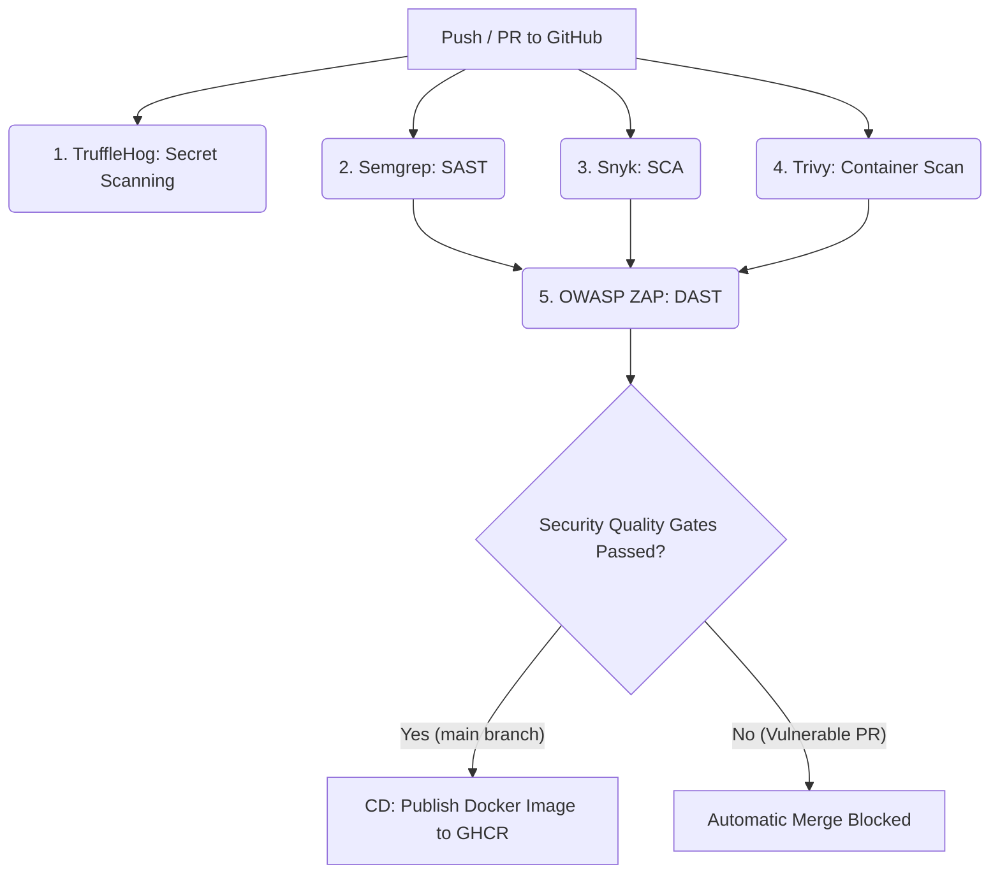
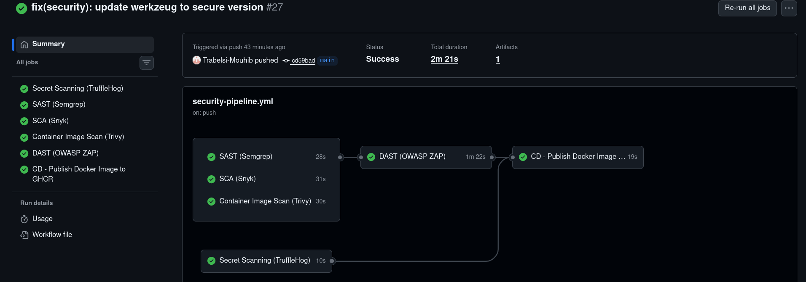
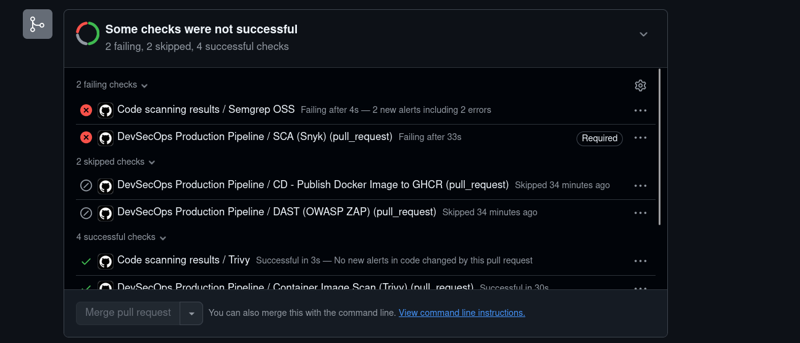
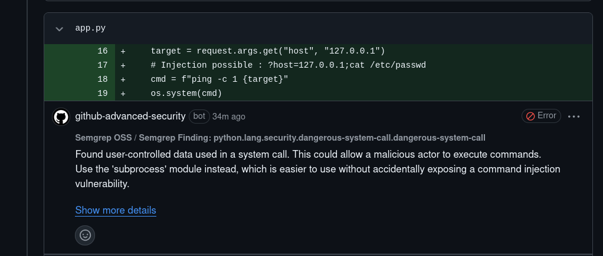

# 🛡️ Automated DevSecOps CI/CD Pipeline


This project implements an enterprise-grade **DevSecOps** software factory based on a containerized Python (Flask) application. It features end-to-end security test automation integrated into GitHub Actions—combining **SAST**, **SCA**, **Secret Scanning**, **Container Scanning**, and **DAST**—paired with Continuous Delivery (**CD**) to **GitHub Container Registry (GHCR)**.

---

## 📐 Pipeline Architecture

The pipeline follows the **"Shift Left"** security principle: every code change is scanned early in the development lifecycle. If any security check fails, branch protection rules physically block merging into the `main` branch.



---

## 🛠️ Tech & Security Stack

| Category | Tool | Pipeline Role |
| :--- | :--- | :--- |
| **Application** | Python / Flask | Containerized REST API |
| **CI/CD & Registry** | GitHub Actions / GHCR | Workflow orchestration and production Docker image hosting |
| **Secret Scanning** | **TruffleHog** | Automated detection of hardcoded API keys, tokens, and credentials |
| **SAST** | **Semgrep** | Static source code analysis (command injection, OWASP Top 10) |
| **SCA** | **Snyk** | Dependency vulnerability scanning (`requirements.txt`) and CVE tracking |
| **Container Scan** | **Trivy** | OS package and base Docker image vulnerability scanning |
| **DAST** | **OWASP ZAP** | Dynamic application security testing on a running container |

---

## 🔒 Security Quality Gates Demonstration

This repository demonstrates automated security enforcement across two dedicated branches:

### 1. `main` Branch (Production Ready)
* Contains secure code and patched dependencies (`werkzeug>=3.0.6`).
* All security checks pass successfully.
* **Result:** The Docker image is built and automatically published to **GHCR**.



### 2. `vulnerable-demo` Branch (Blocking Simulation)
* Contains intentionally injected vulnerabilities:
  * **SAST:** Command injection via `os.system()` in `app.py`.
  * **SCA:** Outdated Python dependencies with known CVEs in `requirements.txt`.
  * **Secrets:** Hardcoded credentials/tokens.
* **Result:** GitHub Actions flags all issues, posts inline security comments directly on the code diff, and **blocks pull request merging**.





---

## 🚀 Getting Started & Deployment

### Pull Production Image from GHCR
To download and run the verified production image directly from GitHub Container Registry:

```bash
docker pull ghcr.io/trabelsi-mouhib/automated-security-cicd:latest
docker run -d -p 5000:5000 ghcr.io/trabelsi-mouhib/automated-security-cicd:latest
```

### Local Setup
```bash
# Clone the repository
git clone [https://github.com/Trabelsi-Mouhib/automated-security-cicd.git](https://github.com/Trabelsi-Mouhib/automated-security-cicd.git)
cd automated-security-cicd

# Build and run locally with Docker
docker build -t app:local .
docker run -p 5000:5000 app:local
```

---

## 📂 Repository Structure

```text
.
├── .github/
│   └── workflows/
│       └── security-pipeline.yml   # DevSecOps GitHub Actions workflow
├── app.py                          # Flask API application
├── Dockerfile                      # Container build instructions
├── requirements.txt                # Python dependencies
└── README.md                       # Project documentation
```

---

## 👤 Author

* **Mouhib Trabelsi** - [GitHub Profile](https://github.com/Trabelsi-Mouhib)